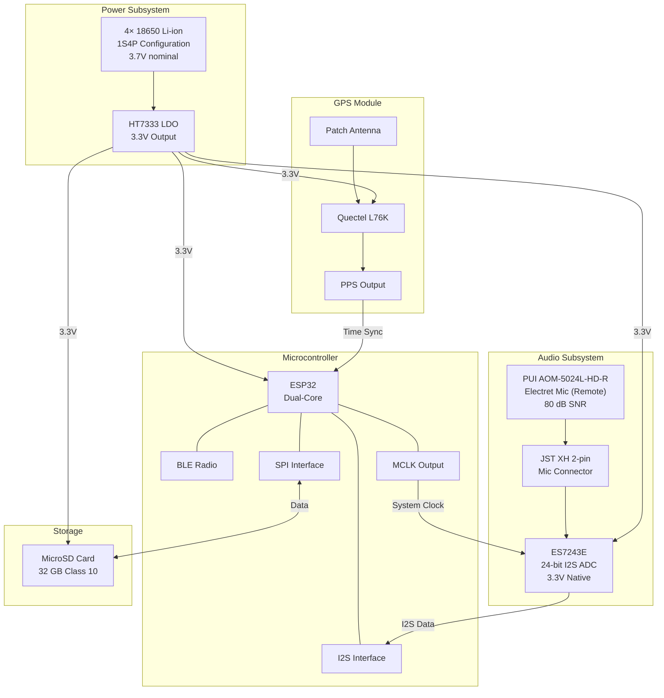
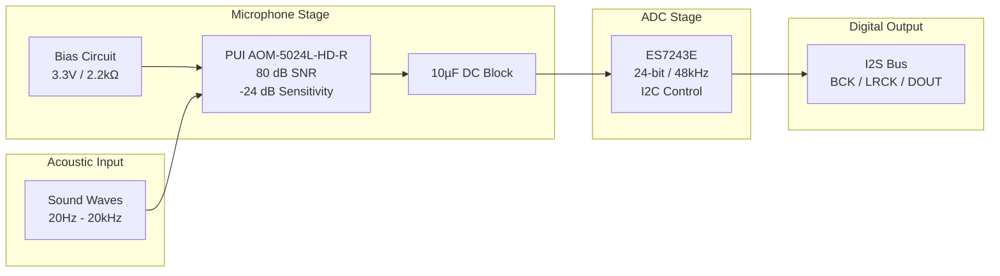
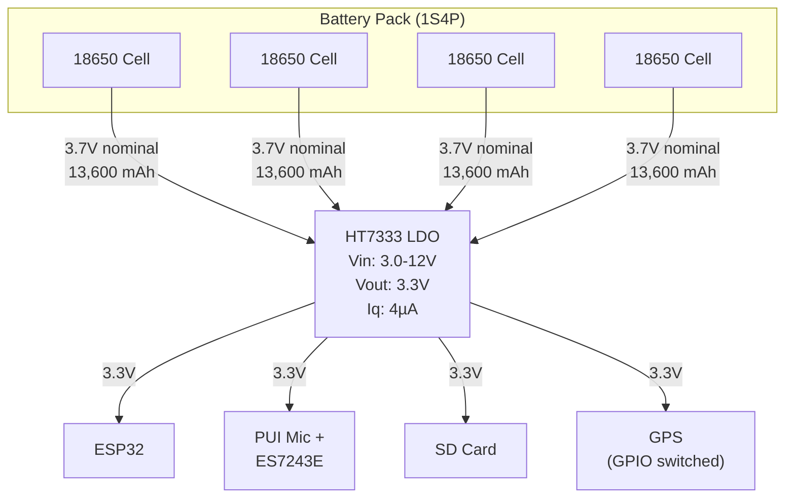
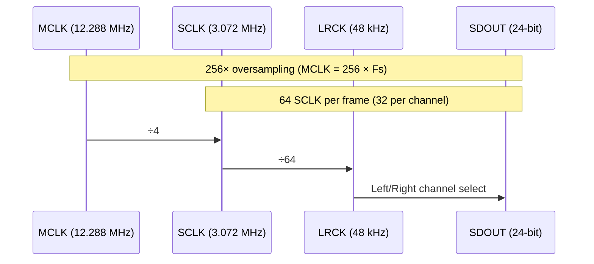
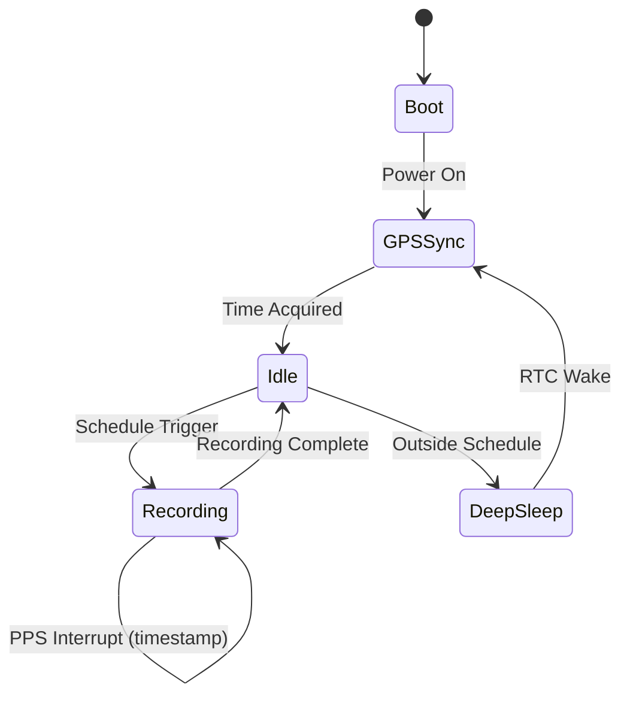
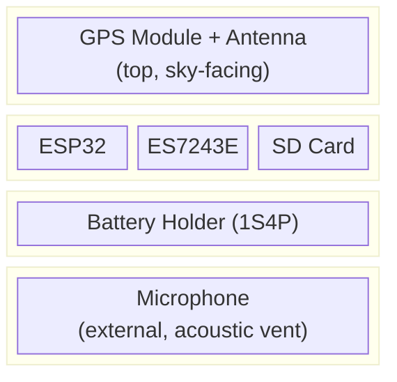
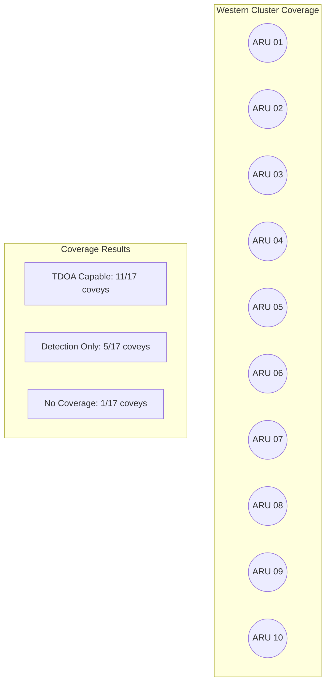

# Autonomous Recording Unit for Quail Population Monitoring

**Design Documentation**

*Version 1.2 — January 12, 2026*

Low-Cost GPS-Synchronized Bioacoustic Recording Platform

---

## 1. Project Overview

### 1.1 Purpose

This document defines the design specifications for a network of low-cost Autonomous Recording Units (ARUs) intended for monitoring quail populations through passive acoustic surveillance. The units will be deployed across property boundaries to capture quail vocalizations, enabling population estimates, movement tracking, and behavioral studies.

### 1.2 Key Features

- GPS-synchronized timestamps with microsecond accuracy across all stations
- High-fidelity audio recording at 48 kHz sample rate
- 3-month autonomous operation on battery power
- Target unit cost under $40
- BLE connectivity for configuration and status monitoring
- Weatherproof enclosure suitable for SE USA temperate climate

### 1.3 Design Requirements

| Parameter | Requirement |
|-----------|-------------|
| Operating Temperature | -10°C to +50°C |
| Battery Life | ≥90 days continuous |
| Time Sync Accuracy | ±1 ms across network |
| Audio Sample Rate | 48 kHz |
| Audio Bit Depth | 16-bit |
| Audio Channels | Mono |
| Audio Format | WAV (PCM) |
| Storage Capacity | ≥32 GB |
| Wireless Config | BLE 4.2+ |
| Enclosure Rating | IP65 minimum |

---

## 2. System Architecture

### 2.1 Block Diagram

### 2.2 Audio Signal Chain

### 2.3 Power Distribution

---

## 3. Component Selection Rationale

### 3.1 Microcontroller: ESP32 (Dual-Core)

The ESP32 (original dual-core variant) was selected to support the high-performance analog microphone subsystem:

- Dual Xtensa LX6 cores for concurrent audio processing and control
- Two I2S peripherals with proper MCLK output support (GPIO 0, 1, or 3)
- Integrated BLE 4.2 and WiFi for wireless configuration
- Well-documented audio examples and library support
- Deep sleep current ~10µA (acceptable with 1S4P battery)
- Unit cost $3-4 for DevKit modules

### 3.2 GPS Module: Quectel L76K

The Quectel L76K is under evaluation as a cost-effective alternative to the u-blox MAX-M10S:

| Parameter | L76K | MAX-M10S |
|-----------|------|----------|
| Price | $8.89 | $13.00 |
| Voltage Range | 2.8-4.3V | 2.7-3.6V |
| Current (tracking) | 29mA | 25mA |
| PPS Output | Yes | Yes |
| PPS Accuracy | ±10ns | ±10ns |

If testing confirms reliable PPS output and Li-ion voltage compatibility, the L76K enables a simplified 1S parallel battery configuration.

### 3.3 Audio Subsystem: PUI AOM-5024L-HD-R + ES7243E ADC

The PUI AOM-5024L-HD-R electret condenser microphone was selected for its exceptional signal-to-noise ratio, which dramatically increases detection range:

**Microphone Specifications:**
- Signal-to-noise ratio: 80 dBA (+19 dB over INMP441)
- Frequency response: 20 Hz - 20 kHz
- Omnidirectional polar pattern
- Acoustic overload point: 110 dB SPL
- Unit cost: ~$1.83 (LCSC)

**ADC Specifications (ES7243E):**
- 24-bit resolution at up to 48 kHz sample rate
- True 3.3V operation (no 5V analog supply required unlike PCM1808/1802)
- I2S digital output compatible with ESP32
- I2C control interface for configuration
- QFN-20 package, SMT assembly compatible
- Unit cost: ~$0.24 (LCSC)

**Detection Range Comparison:**

| Microphone | SNR | Est. Detection Range | TDOA Coverage (10 stations) |
|------------|-----|---------------------|----------------------------|
| INMP441 | 61 dB | ~250-300m | 4-6 coveys |
| ICS-43434 | 64 dB | ~350-400m | 6-7 coveys |
| **PUI AOM-5024L** | **80 dB** | **~800-1200m** | **11-16 coveys** |

The 19 dB SNR improvement translates to approximately 3x greater detection range, reducing required station count while dramatically improving coverage.

**Bias Circuit:**

The electret microphone requires a simple bias circuit: 3.3V through a 2.2kΩ load resistor, with a 10µF DC-blocking capacitor to the ADC input.

---

## 4. Bill of Materials

### 4.1 Electronics BOM (General)

| # | Component | Description | Qty | Unit $ | Total $ |
|---|-----------|-------------|-----|--------|---------|
| 1 | ESP32 DevKit Module | ESP32-WROOM-32 38-pin DevKit | 1 | $3.50 | $3.50 |
| 2 | GPS Module | Quectel L76K | 1 | $8.89 | $8.89 |
| 3 | GPS Antenna | 25×25mm ceramic patch | 1 | $2.00 | $2.00 |
| 4 | Mic Connector | JST XH 2-pin B2B-XH-A (for remote mic) | 1 | $0.02 | $0.02 |
| 4a | Electret Microphone | PUI AOM-5024L-HD-R (sourced separately) | 1 | $1.83 | $1.83 |
| 5 | I2S ADC | ES7243E 24-bit (3.3V native) | 1 | $0.24 | $0.24 |
| 6 | MicroSD Socket | TF-015 push-push | 1 | $0.08 | $0.08 |
| 7 | MicroSD Card | 32GB Class 10 | 1 | $4.00 | $4.00 |
| 8 | Voltage Regulator | HT7333 LDO, 3.3V 250mA | 1 | $0.04 | $0.04 |
| 9 | Battery Connector | JST PH 2-pin SMT | 1 | $0.10 | $0.10 |
| 10 | P-FET Power Switch | SI2301 SOT-23 | 1 | $0.02 | $0.02 |
| 11 | 18650 Cells | 3400mAh Li-ion | 4 | $3.00 | $12.00 |
| 12 | Capacitors | Assorted (see LCSC BOM) | 1 | $0.10 | $0.10 |
| 13 | Resistors | 2.2kΩ (mic bias) | 1 | $0.01 | $0.01 |
| | | | | **Total:** | **$32.81** |

### 4.2 LCSC Parts BOM (for JLCPCB Assembly)

| LCSC # | Component | Description | Package | Qty | Price |
|--------|-----------|-------------|---------|-----|-------|
| C2929446 | ES7243E | 24-bit I2S ADC, 3.3V | QFN-20 | 1 | $0.24 |
| C21583 | HT7333-A | 3.3V 250mA LDO | SOT-89 | 1 | $0.04 |
| C2838031 | Quectel L76K | GPS module with PPS | LCC-18 | 1 | $8.89 |
| C2938372 | SI2301 | P-channel MOSFET | SOT-23 | 1 | $0.02 |
| C113206 | TF-015 | MicroSD card socket | SMD | 1 | $0.08 |
| C158012 | B2B-XH-A(LF)(SN) | Mic connector JST XH 2-pin | Through-hole | 1 | $0.02 |
| C295747 | S2B-PH-SM4-TB | JST PH 2-pin battery conn | SMT | 1 | $0.10 |
| C4190 | 0603WAF2201T5E | 2.2kΩ 0603 1% resistor | 0603 | 2 | $0.001 |
| C14663 | CC0603KRX7R9BB104 | 100nF 0603 X7R capacitor | 0603 | 6 | $0.001 |
| C89827 | CC0805KKX5R7BB106 | 10µF 0805 X5R capacitor | 0805 | 4 | $0.02 |
| C123624 | 0805B475K160CT | 4.7µF 0805 X7R capacitor | 0805 | 2 | $0.03 |

**Notes:**
- All parts verified in-stock at LCSC as of January 2026
- ESP32 DevKit module sourced separately (through-hole, hand-soldered)
- Microphone (PUI AOM-5024L-HD-R) connected via JST XH 2-pin connector for remote mounting
- Remote mic placement reduces RF noise pickup from ESP32 WiFi/BLE

### 4.3 Mechanical BOM

| # | Component | Description | Qty | Unit $ | Total $ |
|---|-----------|-------------|-----|--------|---------|
| 1 | Enclosure | IP65 junction box, 150×100×70mm | 1 | $5.00 | $5.00 |
| 2 | Cable Glands | PG7 waterproof | 2 | $0.50 | $1.00 |
| 3 | Mounting Hardware | Stainless screws, standoffs | 1 | $1.50 | $1.50 |
| 4 | Acoustic Vent | GORE or equivalent | 1 | $2.00 | $2.00 |
| | | | | **Total:** | **$9.50** |

**Grand Total: ~$43/unit** (slightly over $40 target, can be reduced with volume purchasing)

---

## 5. Wiring

### 5.1 Pin Assignments

| ESP32 Pin | Function | Connected To |
|-----------|----------|--------------|
| GPIO32 | I2S Data In | ES7243E SDOUT |
| GPIO15 | I2S Word Select | ES7243E LRCK |
| GPIO14 | I2S Bit Clock | ES7243E SCLK |
| GPIO0 | I2S Master Clock | ES7243E MCLK |
| GPIO21 | I2C SDA | ES7243E SDA |
| GPIO22 | I2C SCL | ES7243E SCL |
| GPIO16 | UART RX | GPS TX |
| GPIO17 | UART TX | GPS RX |
| GPIO4 | PPS Input | GPS PPS |
| GPIO5 | SPI CS | SD Card CS |
| GPIO18 | SPI CLK | SD Card CLK |
| GPIO19 | SPI MISO | SD Card MISO |
| GPIO23 | SPI MOSI | SD Card MOSI |
| GPIO2 | GPS Power | SI2301 Gate (GPS VCC switch) |

### 5.2 I2S Timing

### 5.3 ES7243E I2C Configuration

The ES7243E requires I2C initialization before audio capture. Default I2C address: 0x10 (AD0=Low) or 0x11 (AD0=High).

**Key registers:**
- 0x00: Reset/Mode control
- 0x01: Clock manager
- 0x02-0x09: Analog and digital gain settings

---

## 6. Power Budget

### 6.1 Current Consumption

| State | ESP32 | GPS | Audio | SD Card | Total |
|-------|-------|-----|-------|---------|-------|
| Recording | 80 mA | 29 mA | 10 mA | 100 mA | 219 mA |
| Idle (GPS on) | 20 mA | 29 mA | 10 mA | 0.1 mA | 59 mA |
| Deep Sleep | 0.01 mA | 0 mA | 0 mA | 0.1 mA | 0.11 mA |

### 6.2 Battery Life Estimates

With 1S4P configuration (13,600 mAh):

| Duty Cycle | Daily Recording | Estimated Battery Life |
|------------|-----------------|----------------------|
| Dawn/Dusk only | 4 hours | 90+ days |
| Extended morning | 6 hours | 70+ days |
| Continuous | 24 hours | 18+ days |

---

## 7. Software Architecture

### 7.1 Firmware Overview

### 7.2 Recording Schedule

The system uses GPS-derived sunrise/sunset times to automatically adjust recording windows throughout the season. The NOAA solar calculation algorithm requires ~50 lines of C code and executes in <1ms.

---

## 8. Enclosure Design

### 8.1 Component Layout

### 8.2 Key Design Points

- GPS antenna positioned at top of enclosure with clear sky view
- Microphone mounted externally or through waterproof acoustic vent
- Batteries accessible without disassembly (hot-swap capable)
- All electronics conformal coated for humidity protection
- Desiccant pack inside enclosure

---

## 9. TDOA Network Coverage

### 9.1 Detection Range Impact

With the PUI microphone (80 dB SNR), estimated detection range for bobwhite whistle calls is 800-1200m, compared to 250-300m with INMP441.

### 9.2 Station Layout (10-Station Pilot)

---

## Appendix A: Document Revision History

| Version | Date | Changes |
|---------|------|---------|
| 1.0 | January 2026 | Initial release |
| 1.1 | January 10, 2026 | Audio subsystem redesign: Changed MCU from ESP32-C3 to ESP32 (dual-core). Replaced INMP441 (61dB SNR) with PUI AOM-5024L-HD-R (80dB SNR) + PCM1808 ADC for ~3x detection range increase. Updated BOM, wiring, and block diagrams. |
| 1.2 | January 12, 2026 | ADC change: Replaced PCM1808 (requires 5V analog) with ES7243E (true 3.3V operation). Added LCSC parts BOM for JLCPCB manufacturing. Updated pin assignments for ES7243E I2C control interface. |
