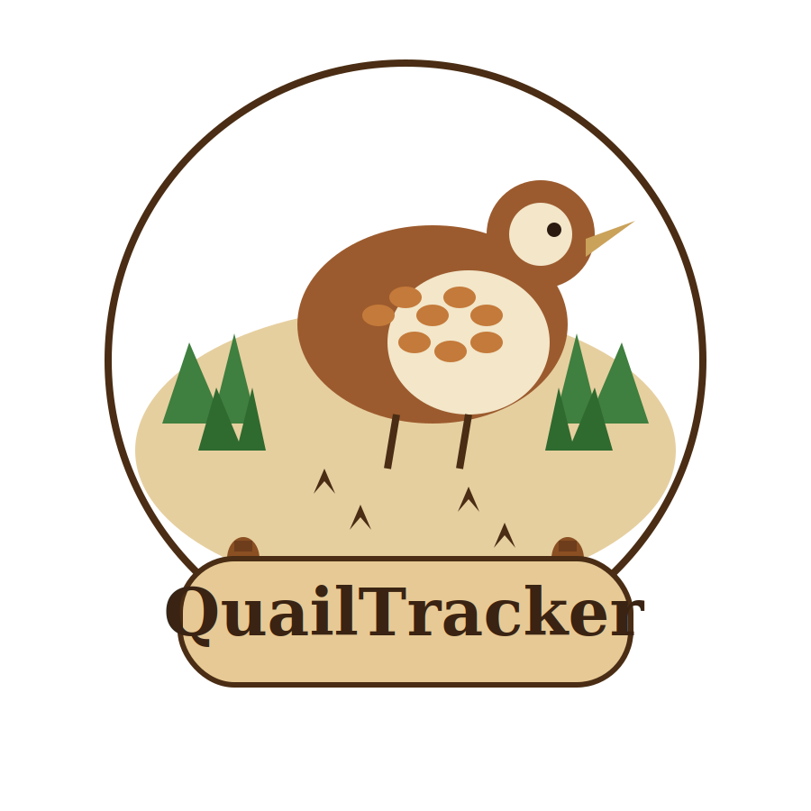

# QuailTracker

<p align="center">
  
</p>

<p align="center">
  Open-source wildlife acoustic monitoring — hardware, apps, and ML training in one ecosystem.
</p>

---

QuailTracker is a complete bioacoustic monitoring system: low-cost recording hardware, a mobile companion app, a desktop analyzer, and a Dockerized model training pipeline. BirdNET provides 6,000+ species identification out of the box, with support for custom-trained on-device models. Defaults are tuned for Northern Bobwhite quail, but every component is configurable for any vocalizing species.

**Use cases:** population surveys, presence/absence monitoring, vocalization mapping, behavioral studies, TDOA source localization.

## Components

### Recording Hardware — Autonomous Recording Unit (~$50/unit)

- **STM32U575** MCU (160 MHz Cortex-M33, 784 KB RAM) with **IM72D128** PDM MEMS mic
- **ATGM336H-5N31** GPS with PPS for sub-millisecond time synchronization across stations
- 48 kHz FLAC recording with GPS coordinates, temperature, and humidity in Vorbis metadata
- On-device **TFLite Micro** inference (DS-CNN, int8, ~80–150 KB) between audio frames
- **~350 µA** Stop 2 sleep with BLE advertising; BLE wake-on-connect and RTC wake
- **CN3791** solar MPPT charger — 90+ days on battery, indefinite with 6V/2W panel
- **PB-03F** BLE 5.2 for wireless configuration, health monitoring, and model deployment

### Companion Mobile App (iOS / Android / Desktop)

Avalonia 11.2 / .NET 10 app with Plugin.BLE. Tabs for health, operations, schedule, config, and live detection streaming. Survey-in for GPS position averaging. Designed for one-handed field use.

### Desktop Analyzer (Windows / macOS / Linux)

Avalonia 11.2 / .NET 10 desktop app for post-processing recordings:
- BirdNET ONNX inference (single file or multi-threaded batch)
- Mel spectrogram viewer with noise reduction toggle
- TDOA source localization from multi-station synchronized recordings
- N-mixture population models with weather covariates
- Interactive Leaflet map with KML export
- Training data curation and export

### Training Container (Docker)

Dockerized Python/TensorFlow pipeline with a Flask web UI:
1. Download from xeno-canto with **BirdNET-verified** clip extraction
2. Mel spectrogram dataset with augmentation (time shift, noise, SpecAugment, pitch)
3. DS-CNN training with focal loss and early stopping on AUC
4. Int8 TFLite export + C header for direct firmware embedding

## Repository Structure

```
QuailTracker/
├── stm32/QuailTracker_U575/   # STM32U575 firmware (CubeMX + PlatformIO)
├── app/                       # Companion mobile app (Avalonia)
├── analyzer/                  # Desktop analyzer (Avalonia)
├── training/                  # Model training pipeline (Docker/Flask)
├── hardware/                  # Schematics, BOM, pinout docs
├── docs/                      # Documentation
│   └── ecosystem.md           # Full ecosystem specification
└── README.md
```

## Getting Started

### Firmware

```bash
# Build STM32U575 firmware
pio run -e nucleo_u575zi_q
pio run -e nucleo_u575zi_q --target upload
```

### Training Container

```bash
cd training
docker build -t quailtracker-training .
docker run -p 5000:5000 -v $(pwd)/output:/output quailtracker-training
# Open http://localhost:5000
```

### Apps

```bash
# Desktop analyzer
dotnet run --project analyzer/Desktop

# Companion app (desktop mode)
dotnet run --project app/Desktop
```

## Adapting to Other Species

| Component | What to change |
|-----------|---------------|
| **Training** | Enter species name, adjust BirdNET confidence threshold, run pipeline |
| **Hardware** | Set gain/filter for target frequency range, deploy new TFLite model |
| **Analyzer** | Set BirdNET species filter, adjust population model parameters |
| **App** | Update gain, filter, and schedule on each station via BLE |

Everything else — TDOA, population modeling, export formats, power management — works identically regardless of target species.

## Documentation

See [docs/ecosystem.md](docs/ecosystem.md) for the full ecosystem specification.

## License

[MIT License](LICENSE)
